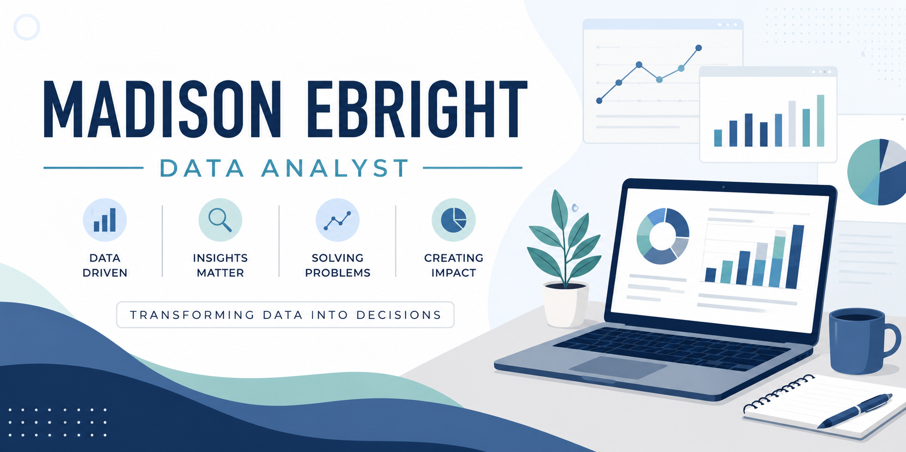

  

 

# Hi, I'm Maddie Ebright 👋

## About Me

I am a data technichian with a B.S. in Applied Mathematics and am currently pursuing my MBA at Biola University. My background combines mathematics, statistics, business analytics, and real-world data analysis.

I have experience working with forecasting, optimization, time-series analysis, data cleaning, visualization, and large datasets. I enjoy using data to solve practical problems and support better decision-making.

## Technical Skills

- **Languages:** Python, SQL
- **Python Libraries:** Pandas, NumPy, Matplotlib, SciPy, Statsmodels
- **Data Analysis & Visualization:** Excel, Tableau
- **Modeling & Methods:** Time-Series Forecasting, Linear Programming, Optimization, Differential Equations
- **Tools & Platforms:** GitHub, Jupyter Notebook, ArcGIS, Survey123

## Currently Learning

- SQL course through DataCamp

## Education

**MBA — Biola University**  
Currently pursuing

**B.S. in Applied Mathematics and a Minor In Business — Grand Valley State University**

## Connect With Me

- LinkedIn: www.linkedin.com/in/maddie-ebright-54749a314

